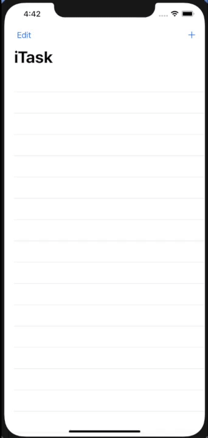

# iTask: an iOS Demo App for MongoDB GraphQL

## Description
MongoDB Stitch provides GraphQL APIs to access data stored in MongoDB Atlas. This tutorial walks through a simple TODO application in which users can create, read, update, and delete tasks using GraphQL.

## The Software Stack
- Backend
  - [MongoDB Atlas](https://cloud.mongodb.com/) (Database as a Service)
  - [MongoDB Stitch](https://www.mongodb.com/cloud/stitch) (Serverless platform)
- Frontend
  - SwiftUI/Swift

## Demo


## Getting Started

Before the React application can be run, MongoDB Atlas and Stitch must be configured.

### MongoDB Atlas Setup

A MongoDB Atlas cluster is needed for the application (skip this section if you already have one which can be used.). Follow this [tutorial](https://docs.atlas.mongodb.com/getting-started/#deploy-a-free-tier-cluster) to create an Atlas cluster.

For this tutorial an "M0", our free-forever instance, is sufficient.

### Stitch Setup

From the Atlas UI lets create a stitch app, follow the instructions found [here](https://docs.mongodb.com/stitch/procedures/create-stitch-app/).

Take note of the application id (APP ID), this will be required later for application configuration.

**NOTE**: during this configuration process, we can wait till the end to review and deploy all  changes, but I would recommend deploying as each step is performed. Alternatively, turn off "Drafts" under the "Deploy/Configuration" Stitch tab.

#### Link Database Cluster

While creating the Stitch application be sure to link to the cluster created above. If using an existing Stitch application, the database cluster must be linked to that app, following [these instructions](https://docs.mongodb.com/stitch/mongodb/link-a-cluster/).

#### Enable Authentication

The frontend application requires anonymous authentication, set this provider up using the instructions found [here](https://docs.mongodb.com/stitch/authentication/anonymous/)

#### Create Data Access Rules

For users to access data held in Atlas, a Stitch Rule must be added for the collection that will hold the data. For this tutorial, use the simple template where an authenticated user can read and write just their own data only by following [these instructions](https://docs.mongodb.com/stitch/mongodb/define-roles-and-permissions/).

Select the `iTask` database and the `task` collection, the rule will be applied to this collection only.

The template to use is `Users can only read and write their own data`, for the "field name for the user id" section enter `owner_id`.

#### Create JSON Schema 

Create a schema for the collection, that is used in the GraphQL API.

Use [these instructions](https://docs.mongodb.com/stitch/mongodb/enforce-a-document-schema/) to define the schema:

```json
{
  "properties": {
    "_id": {
      "bsonType": "objectId"
    },
    "id": {
      "bsonType": "string"
    },
    "name": {
      "bsonType": "string"
    },
    "description": {
      "bsonType": "string"
    },
    "tags": {
      "bsonType": "array",
      "uniqueItems": true,
      "items": {
        "bsonType": "string"
      }
    },
    "owner_id": {
      "bsonType": "string"
    },
    "createdAt": {
      "bsonType": "date"
    },
    "active": {
      "bsonType": "boolean"
    },
    "modifiedAt": {
      "bsonType": "date"
    },
    "archived": {
      "bsonType": "boolean"
    },
    "archivedAt": {
      "bsonType": "date"
    },
    "finished": {
      "bsonType": "boolean"
    },
    "finishedAt": {
      "bsonType": "date"
    },
    "dueBy": {
      "bsonType": "date"
    },
    "recurringTask": {
      "bsonType": "boolean"
    },
    "recurringDate": {
      "bsonType": "date"
    }
  }
}
```

Not all the fields are currently being used by the app.

Please remember to review and deploy the changes to take effect.

At this point, the Stitch application is providing the GraphQL API,

#### Testing The GraphQL Interface

From the Stitch UI, go to the `GraphQL` menu (found on the left hand side), this will bring up the GraphQL editor and documentation explorer.

Using the documentation and the UI various queries can be tested here. Because we are entering queries in the Admin UI, the `owner_id` attribute is not needed.

Take a note of the GraphQL endpoint listed on that screen.